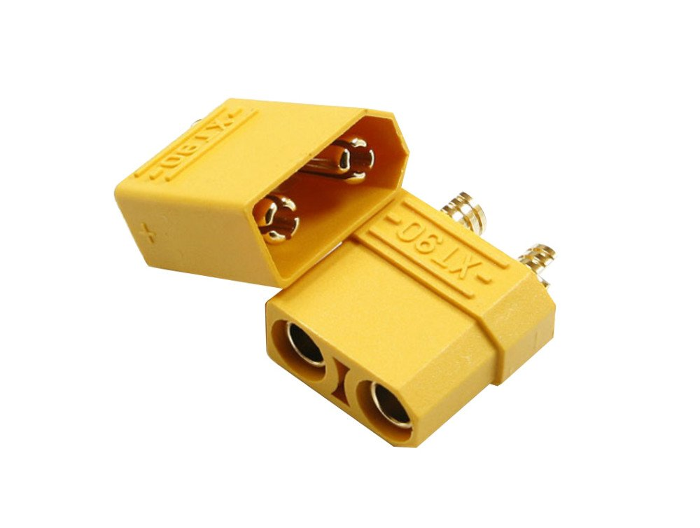
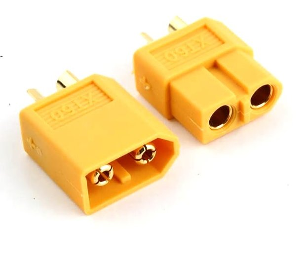
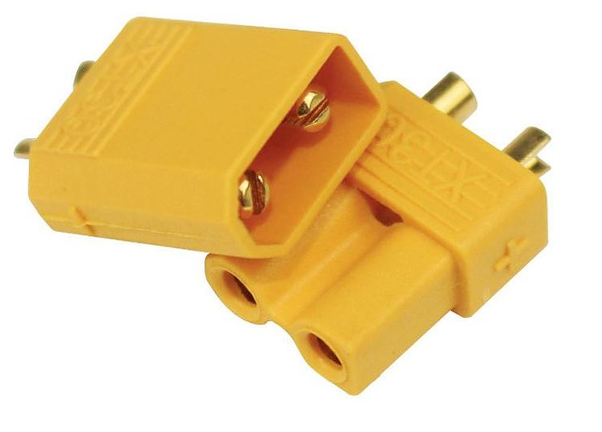
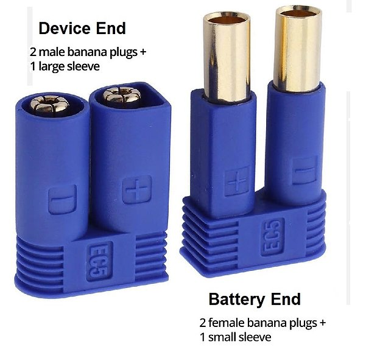
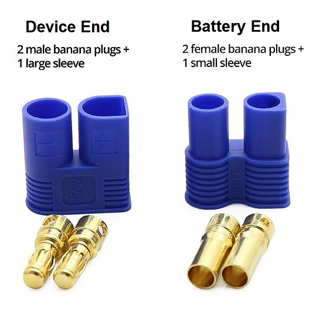
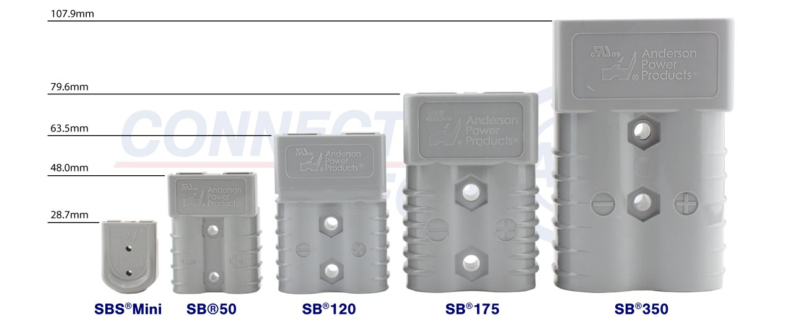

## Wire
---
Silicone insulated wire with 200C temperature rating.

| AWG | D [mm] | A [mm2]| R [mO/m]| [A] [1] | [A] [2] | [A] [3]  | [A] burst |
|---|-----|-----|-----|-----|----|----|-----|
| 2 | 6.54| 33.6| 0.51|  840|    | 240|
| 4 | 5.19| 21.2| 0.82|  530|    | 180|
| 6 | 4.11| 13.26| 1.3|  321|    | 135|
| 8 | 3.26| 8.37|  2.1|  209| 180| 100|  
| 10| 2.59| 5.26|  3.3|  130| 120|  75| 250|
| 12| 2.05| 3.31|  5.2|   75|  70|  55| 160|
| 14| 1.63| 2.08|  8.3|   51|  45|  45|
| 16| 1.29| 1.31| 13.2|   32|  30|  32|
| 18| 1.02| 0.823|  21| 20.6|  20|  24|
| 19| 0.91| 0.65| 26.4|   16|    |    |
| 20| 0.81| 0.52| 33.3|   13|  12|  17|
| 22| 0.64| 0.32|  53 |  7.8|    |  13|
| 24| 0.51| 0.21|  84 |  5.3|    |  10|
| 26| 0.41| 0.13| 134 |  3.2|    |   7|
| 28| 0.32| 0.08| 213 |  1.9|    |   6|
| 30| 0.26| 0.051|339 |  1.3|    |   4|

Simple approximation for current is **A[mm2]x25** [1].   
A slighltly better one **(D[mm]x39)^2 / 80** [2]

Single core to multicore up to 0.33..0.5 factor current reduction.  

Resistivity of Copper 1.68 10^-8  [Ohm m]  
Resistivity of Solder 63% Pb 37% Sn 1.65 10^-7 [Ohm m] (10 times less)  

* [1] https://sparks.gogo.co.nz/silicone-wire-current-capacity.html
* [2] https://www.4-max.co.uk/silicone-wire.htm
* [3] https://www.multicable.com/resources/reference-data/current-carrying-capacity-of-copper-conductors/

## Connectors 
-----
| Name  | Current [A]| Burst [A] | Connector Diameter [mm] | Wire Cup [AWG] / [mm] |
|-------|---------|-------|--------------------|--------------| 
| **JST**
| JST PH| 1-2 | 10  | | 32-24
| **XT**
| XT90  | 90  | 180 | 4.5 | 8/8mm
| XT60  | 60  | 120 | 3.5 | 12/3mm |
| XT30  | 30  | 60  | 2 | 16/1.5mm |
| **EC**
| EC5   | 120 | 150 | 5 |  8-10 / 4.77mm
| EC3   | 60  | 75  | 3.5| 12/3.5mm
| EC2   | 20  | 30  | | 16
| **Bullet**
| 2mm bullet | 25 || 2 | 20
| 3mm bullet | 50 || 3 | 18
| 4mm bullet | 70-100  | | 4 | 13-16
| 6mm bullet | 120-140 | | 6 | 10
| 8mm bullet | 200 | | 8 | 4
| **Anderson** 
| SB50  | 50(120) | | | 1-6
| SB120 | 130(240) | | | 10-1 
| SB175 | 175(280) | | | 12-0/1
| SB350 | 500 |
| **Powerpole**
| PowerPole 10 | | | |14-16
| PowerPole 15 | 55 | | |10-20
| PowerPole 30 | | | | 10
| PowerPole 75 | 120 | | | 6-16 
| PowerPole 120 | 240 | | | 8
| PowerPole 180 | 350 | | | 3/0

## **XT**
----

## **EC**
----

## **Anderson**
----

